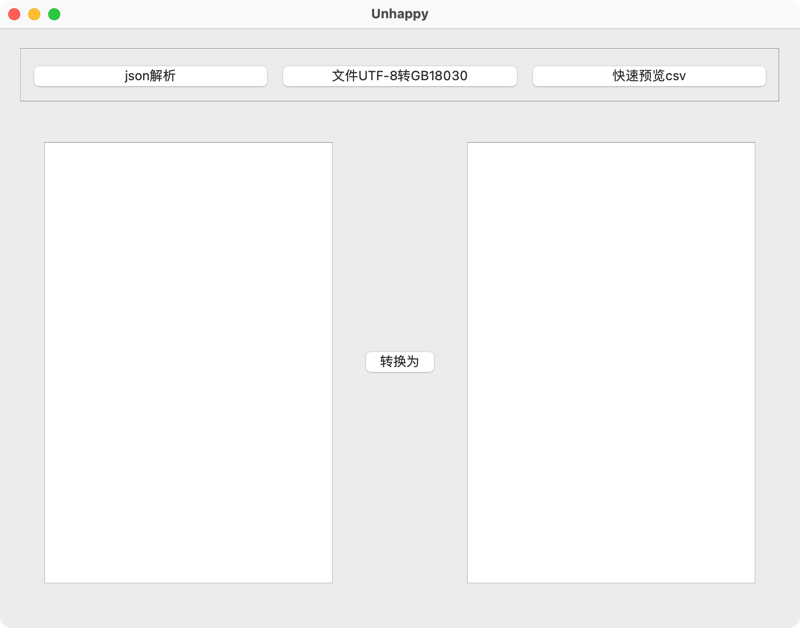

# unhappy_evolution

## Description

A collection of small functions for daily use.

### Tools

1. Parse json string. Then format it into plain formatted string and formatted structure table view.

+ parse to plain string.
 
  
+ parse to structure.

  
2. Drag UTF-8 files to window. Then transform these files into GB18030. This is used for mac users sending csv files to windows user.

3. Drag big csv files and preview lines by your config.

+ You will get summary in this page.

  
+ You will get csv content in this page.

  
Build

+ Install qt5.15.2 on your mac.
+ Found you clang in qt5.15.2 directory and set your clang directory.
+ Build this project with cmake.